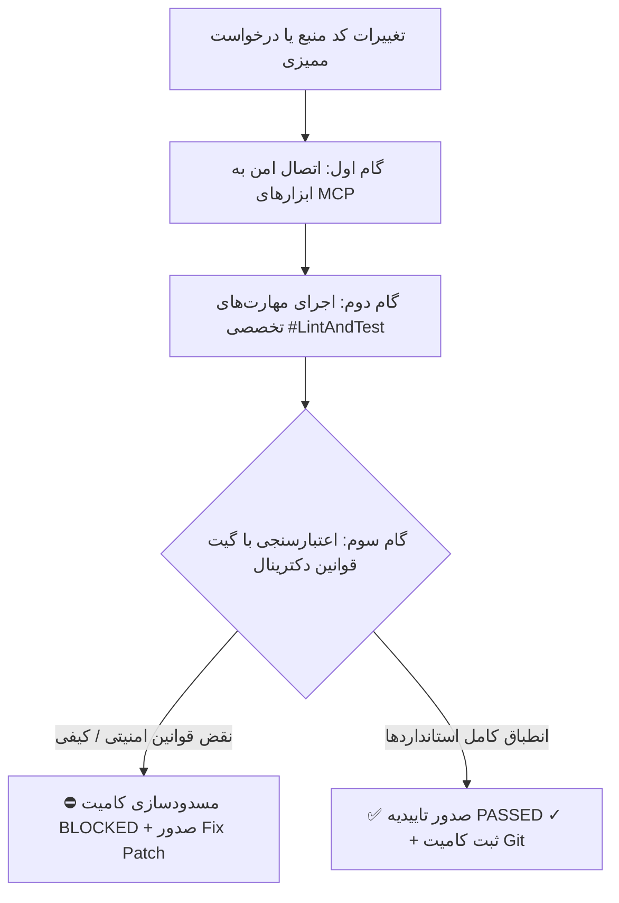

# 📘 کتابچه راهنمای جامع کاربران و راهنمای عملیاتی OmniOps Enterprise
### راهنمای رسمی مهندسی، استقرار هیبریدی، اتصال نودهای محاسباتی، پیکربندی هوشمند منابع و مانیتورینگ لحظه‌ای کلاستر

**نسخه مستندات:** `v3.4.0-Enterprise`  
**تاریخ به‌روزرسانی:** سپتامبر ۲۰۲۶  
**سطح طبقه‌بندی:** مستندات فنی و عملیاتی مدیران ارشد سیستم، معماران DevOps و تیم‌های امنیت زیرساخت  
**وضعیت معماری:** توزیع‌شده (Master Control-Plane + Multi-Worker Hybrid Mesh)  

---

## 📑 فهرست تفصیلی مطالب
1. [⚡ دستورات نصب سریع و استقرار تک‌خطی (Fast One-Line Installers)](#۱-دستورات-نصب-سریع-و-استقرار-تکخطی)
2. [🏛️ معماری کلان و فلسفه هسته توزیع‌شده (System Architecture & Philosophy)](#۲-معماری-کلان-و-فلسفه-هسته-توزیعشده)
3. [🧩 تمامی قابلیت‌ها و سرویس‌های هسته مرکزی (Core Capabilities & Service Stack)](#۳-تمامی-قابلیتها-و-سرویسهای-هسته-مرکزی)
   - ۳.۱. [مرکز فرماندهی OmniOps Core Hub (:9000 / :8080)](#۳۱-مرکز-فرماندهی-omniops-core-hub)
   - ۳.۲. [موتور استنتاج محلی هوش مصنوعی Ollama (:11434) و مدل‌های ملی](#۳۲-موتور-استنتاج-محلی-هوش-مصنوعی-ollama-و-مدلهای-ملی)
   - ۳.۳. [موتور تحلیل آفلاین و بدون توکن اسناد AnythingLLM (:3001)](#۳۳-موتور-تحلیل-آفلاین-و-بدون-توکن-اسناد-anythingllm)
   - ۳.۴. [میکروسرویس پردازش سریع و OCR اسناد JEV Reader (:8000)](#۳۴-میکروسرویس-پردازش-سریع-و-ocr-اسناد-jev-reader)
   - ۳.۵. [استودیوی ویژوال خطوط لوله هوش مصنوعی Langflow (:7860)](#۳۵-استودیوی-ویژوال-خطوط-لوله-هوش-مصنوعی-langflow)
   - ۳.۶. [اتوماسیون رویدادمحور و وب‌هوک‌های اضطراری n8n (:5678)](#۳۶-اتوماسیون-رویدادمحور-و-وبهوکهای-اضطراری-n8n)
   - ۳.۷. [سیستم حافظه پایدار چت‌بات هسته (Persistent Memory Bank)](#۳۷-سیستم-حافظه-پایدار-چتبات-هسته)
   - ۳.۸. [کنسول امن روت شل و لاگ‌های معماری (Architecture Audit Logs)](#۳۸-کنسول-امن-روت-شل-و-لاگهای-معماری)
4. [🔗 روش گام‌به‌گام اتصال و همگام‌سازی Worker Nodeها](#۴-روش-گامبهگام-اتصال-و-همگامسازی-worker-nodeها)
   - ۴.۱. [مراحل ثبت دستی از طریق پنل ادمین](#۴۱-مراحل-ثبت-دستی-از-طریق-پنل-ادمین)
   - ۴.۲. [فرآیند اتصال خودکار با اسکریپت تک‌خطی (Auto-Join Agent)](#۴۲-فرآیند-اتصال-خودکار-با-اسکریپت-تکخطی)
   - ۴.۳. [پیکربندی نقش‌های تخصصی نودها (Worker Roles)](#۴۳-پیکربندی-نقشهای-تخصصی-نودها)
   - ۴.۴. [سازوکار هندشیک امن و همگام‌سازی کلیدها](#۴۴-سازوکار-هندشیک-امن-و-همگامسازی-کلیدها)
5. [🧠 پیکربندی هوشمند منابع و ارزیابی سخت‌افزار (Resource Allocation & Schedulers)](#۵-پیکربندی-هوشمند-منابع-و-ارزیابی-سختافزار)
   - ۵.۱. [موتور ممیزی خودکار سخت‌افزار در حین نصب (Hardware Assessment Engine)](#۵۱-موتور-ممیزی-خودکار-سختافزار-در-حین-نصب)
   - ۵.۲. [زمان‌بندی هوشمند وظایف شبانه در ساعات خلوتی (Off-Peak Scheduler)](#۵۲-زمانبندی-هوشمند-وظایف-شبانه-در-ساعات-خلوتی)
   - ۵.۳. [بهینه‌سازی مصرف حافظه، کش سیستم‌عامل و بافرهای VRAM](#۵۳-بهینهسازی-مصرف-حافظه-کش-سیستمعامل-و-بافرهای-vram)
   - ۵.۴. [سوییچ هوشمند خودکار و تاب‌آوری در برابر قطعی اینترنت (Failover Cascade)](#۵۴-سوییچ-هوشمند-خودکار-و-تابآوری-در-برابر-قطعی-اینترنت)
6. [📊 ابزارهای مانیتورینگ، سلامت کلاستر و تله‌متری زنده](#۶-ابزارهای-مانیتورینگ-سلامت-کلاستر-و-تلهمتری-زنده)
   - ۶.۱. [داشبورد دایره‌ای سلامت نودها (Cluster Health Donut Radar)](#۶۱-داشبورد-دایرهای-سلامت-نودها)
   - ۶.۲. [جریان لحظه‌ای تله‌متری (Live Telemetry Stream) و مقیاس‌های حسی](#۶۲-جریان-لحظهای-تلهمتری-و-مقیاسهای-حسی)
   - ۶.۳. [تست تشخیصی مش کامل شبکه (Full Mesh Diagnostic Test)](#۶۳-تست-تشخیصی-مش-کامل-شبکه)
   - ۶.۴. [سیستم اعلام هشدارهای زودهنگام و پیشگیرانه](#۶۴-سیستم-اعلام-هشدارهای-زودهنگام-و-پیشگیرانه)
7. [🛡️ ماتریس امنیتی شبکه، پورت‌ها و معماری Zero-Trust](#۷-ماتریس-امنیتی-شبکه-پورتها-و-معماری-zero-trust)
8. [🛠️ راهنمای جامع خط فرمان، دستورات مدیریتی و عیب‌یابی (CLI & Troubleshooting)](#۸-راهنمای-جامع-خط-فرمان-دستورات-مدیریتی-و-عیبیابی)
9. [📋 بهترین تجارب استقرار سازمانی و نکات امنیتی (Enterprise Best Practices)](#۹-بهترین-تجارب-استقرار-سازمانی-و-نکات-امنیتی)
10. [🤖 پایپ‌لاین ایجنت مهندسی، پروتکل MCP، گیت‌های دکترینال و پوسته سازمانی](#۱۰-پایپلاین-ایجنت-مهندسی-پروتکل-mcp-گیتهای-دکترینال-و-پوسته-سازمانی)
    - ۱۰.۱. [چرخه بسته مهندسی: دسترسی (MCP) ⟷ راهنما (Skills) ⟷ گیت محدودیت (Rules Gate)](#۱۰۱-چرخه-بسته-مهندسی-دسترسی-mcp--راهنما-skills--گیت-محدودیت-rules-gate)
    - ۱۰.۲. [سرورهای چهارگانه پروتکل کانتکست مدل (MCP) و ۱۸ ابزار کنترلی](#۱۰۲-سرورهای-چهارگانه-پروتکل-کانتکست-مدل-mcp-و-۱۸-ابزار-کنترلی)
    - ۱۰.۳. [مهارت‌های تخصصی ایجنت: #LintAndTest, #AutoTest, #DocGen, #QualityGate](#۱۰۳-مهارتهای-تخصصی-ایجنت-lintandtest-autotest-docgen-qualitygate)
    - ۱۰.۴. [سند بالادستی SYSTEM_RULES.md، سیاست افشای صفر توکن و پچ اصلاحی](#۱۰۴-سند-بالادستی-system_rulesmd-سیاست-افشای-صفر-توکن-و-پچ-اصلاحی)
    - ۱۰.۵. [پوسته و دسترسی‌پذیری سازمانی (Theme Toggle - WCAG AA)](#۱۰۵-پوسته-و-دسترسیپذیری-سازمانی-theme-toggle---wcag-aa)

---

## ۱. دستورات نصب سریع و استقرار تک‌خطی

برای استقرار و راه‌اندازی فوری پشته نرم‌افزاری روی سرورهای **Ubuntu 20.04 / 22.04 / 24.04 LTS**، دستورات زیر را متناسب با نقش سرور در ترمینال لینوکس اجرا کنید:

### ۱.۱. فرمان نصب سرور کنترل مرکزی (Master Control-Plane)
این دستور پیش‌نیازها، پایتون، داکر، شبکه امن مش، پنل وب ادمین و ماژول‌های مرکزی را در کمتر از ۳ دقیقه نصب و راه‌اندازی می‌کند:

```bash
curl -fsSL https://raw.githubusercontent.com/omniops-enterprise/core/main/install.sh | bash -s -- \
  --role master \
  --admin-user "admin" \
  --admin-pass "OmniOps#2026!Sec" \
  --web-port 9000 \
  --enable-mesh
```

**پارامترهای قابل تنظیم:**
- `--role master`: تعیین نقش سرور به عنوان مغز مرکزی و کنترل‌پنل ارکستراتور.
- `--admin-user`: نام کاربری ریشه جهت ورود به وب‌پنل ادمین (پیش‌فرض: `admin`).
- `--admin-pass`: رمز عبور پیچیده ادمین (حداقل ۸ کاراکتر شامل حروف بزرگ، اعداد و نشانه‌ها).
- `--web-port`: پورت ورودی وب‌پنل (پیش‌فرض: `9000` یا `8080`).
- `--enable-mesh`: ایجاد شبکه ایزوله و پرسرعت Docker Mesh و WireGuard Bridge.

---

### ۱.۲. فرمان اتصال نودهای پردازشی کمکی (Worker Compute Nodes)
این دستور روی سرورهای دوم و سوم که دارای منابع پردازشی قوی (RAM بالا یا کارت گرافیک‌های NVIDIA) هستند اجرا می‌شود تا بی‌درنگ به استخر پردازشی متصل شوند:

```bash
curl -fsSL https://raw.githubusercontent.com/omniops-enterprise/core/main/install-worker.sh | bash -s -- \
  --master "http://192.168.1.100:9000" \
  --token "omni-node-join-token-sec99" \
  --name "Worker-Node-GPU-02" \
  --role llm_heavy \
  --agent-port 9001
```

**پارامترهای الحاق ورکر:**
- `--master`: آدرس IP و پورت سرور مرکزی Master Node.
- `--token`: توکن امنیتی احراز هویت ایجاد شده در پنل ادمین.
- `--name`: نام مشخصه سرور در داشبورد مانیتورینگ.
- `--role`: نقش سرور (`llm_heavy` برای استنتاج هوش، `embedding_rag` برای پایگاه دانش، یا `hybrid_worker`).
- `--agent-port`: پورت ایجنت ارتباطی تله‌متری لحظه‌ای (پیش‌فرض: `9001`).

---

## ۲. معماری کلان و فلسفه هسته توزیع‌شده

### ۲.۱. چالش سامانه‌های سنتی تک‌سروره هوش مصنوعی (Single-Node Bottleneck)
در استقرارهای متداول، مهندسان تمام اجزای نرم‌افزاری شامل وب‌پنل مدیریتی، پایگاه‌داده، کش ردیف‌ها و مدل‌های حجیم زبانی (LLM) را بر روی یک سرور منفرد نصب می‌کنند. در این الگو، به محض اینکه کاربران سازمانی چند پرامپت سنگین استدلالی ارسال کنند یا پردازش اسناد قطور فعال شود:
1. مدل زبانی کل رم و پردازنده سرور را به اشغال درمی‌آورد.
2. هسته سیستم‌عامل لینوکس فرآیند **OOM-Killer (Out of Memory)** را فعال می‌کند.
3. در نتیجه، وب‌پنل ادمین، دیتابیس و ارتباطات شبکه کرش کرده و کل سیستم بدون امکان احیای خودکار متوقف می‌گردد.

### ۲.۲. تفکیک معماری OmniOps Enterprise (Master-Worker Decoupling)
پلتفرم OmniOps این چالش را با معماری کلاسترینگ دوسطحی ریشه‌کن کرده است:

```
                  ┌────────────────────────────────────────────────────────┐
                  │          OMNIOPS MASTER CONTROL-PLANE NODE            │
                  │   IP: 192.168.1.100 | Port: 9000/8080 (Lightweight)    │
                  ├────────────────────────────────────────────────────────┤
                  │  • Web Dashboard & RBAC 3-Tier Security                │
                  │  • Cluster Health Donut Radar (Live Telemetry Stream)  │
                  │  • Smart Off-Peak Scheduler & Cron Orchestrator        │
                  │  • SQLite / PostgreSQL Master DB & Redis High-Speed Bus│
                  │  • Failover Cascade Bridge (Auto Router)               │
                  └─────────────────────────┬──────────────────────────────┘
                                            │
               ┌────────────────────────────┴───────────────────────────┐
               │    Zero-Trust Encrypted WireGuard / Docker Mesh Mesh   │
               ▼                                                        ▼
┌──────────────────────────────────────┐     ┌──────────────────────────────────────┐
│       WORKER NODE 01 (GPU-01)        │     │       WORKER NODE 02 (CPU-02)        │
│  IP: 192.168.1.101 | Role: llm_heavy │     │  IP: 192.168.1.102 | Role: hybrid    │
├──────────────────────────────────────┤     ├──────────────────────────────────────┤
│ • Ollama GPU Engine (:11434)         │     │ • JEV OCR & Fast Chunking (:8000)    │
│ • DeepSeek-R1 (14B) & Dorna 2 (8B)   │     │ • AnythingLLM Vector Store (:3001)   │
│ • NVIDIA Container Toolkit (CUDA)    │     │ • Langflow Visual Flows (:7860)      │
│ • Local VRAM Monitor Agent (:9001)   │     │ • n8n Workflow Automation (:5678)    │
└──────────────────────────────────────┘     └──────────────────────────────────────┘
```

**مزایای این معماری:**
- **پایداری ۱۰۰٪ پنل مرکزی (Zero-Downtime):** پنل ادمین روی سرور مرکزی هرگز تحت تأثیر مصرف پردازشی مدل‌ها قرار نمی‌گیرد و همیشه در دسترس است.
- **توزیع بار نامحدود (Horizontal Scalability):** بدون خاموش کردن سیستم، می‌توان در هر زمان نودهای سوم، چهارم و دهم را به کلاستر اضافه کرد.
- **ایزولاسیون کامل حریم خصوصی (Air-Gapped & Zero-Token):** هیچ‌یک از اسناد و مکالمات از بستر شبکه سازمان خارج نشده و هزینه اشتراک ابری به صفر می‌رسد.

---

## ۳. تمامی قابلیت‌ها و سرویس‌های هسته مرکزی

### ۳.۱. مرکز فرماندهی OmniOps Core Hub (:9000 / :8080)
- **دروازه ورودی و ارکستراتور:** پورت ۹۰۰۰ ورودی مرکزی وب‌پنل ری‌اکت، APIهای RESTful و WebSocketهای بلادرنگ است.
- **کنترل دسترسی سه سطحی (Role-Based Access Control - RBAC):**
  - **مدیر ارشد (System Super-Admin):** دسترسی کامل به ترمینال روت، پیکربندی کرون‌جاب‌ها، الحاق نودها و تغییر متغیرهای پایدار.
  - **اپراتور شبکه (Network Operator):** مشاهده وضعیت مانیتورینگ نودها، تست سلامت مش و بررسی لاگ‌های لایف‌سایکل.
  - **کاربر عادی سازمانی (Standard User):** استفاده از چت‌بات هوش مصنوعی، بارگذاری اسناد و تحلیل فایل‌ها در محدوده مجاز.

### ۳.۲. موتور استنتاج محلی هوش مصنوعی Ollama (:11434) و مدل‌های ملی
این سرویس به صورت کانتینری وظیفه لود وزن مدل‌ها، مدیریت حافظه GPU/VRAM و ارائه API با استاندارد سازگار با OpenAI را بر عهده دارد:
- **پشتیبانی اختصاصی از مدل‌های ملی ایرانی:**
  - **Dorna 2:8b (`ollama/dorna2:8b`):** قوی‌ترین مدل ملی آموزش‌دیده بر روی متون رسمی اداری، مکاتبات شرکتی، بخش‌نامه‌ها و قوانین سازمانی ایران.
  - **Maral 7B (`ollama/maral:7b`):** مدل زبان فارسی بر پایه معماری بهینه‌شده Mistral مناسب پرسش‌وپاسخ‌های سریع اداری.
- **مدل‌های استدلال عمیق و منطقی (Chain-of-Thought):**
  - **DeepSeek-R1:8b و DeepSeek-R1:14b:** مناسب کشف باگ‌های نرم‌افزاری، تحلیل لاگ‌های نفوذ شبکه و تحلیل سناریوهای پیچیده تجاری.
- **مدل‌های مهندسی نرم‌افزار و دواپس:**
  - **Qwen2.5-Coder:7b و Qwen2.5-Coder:14b:** تولید دقیق اسکریپت‌های Bash، کانفیگ‌های Nginx، سناریوهای فایروال MikroTik و اسکریپت‌های پایتون.

### ۳.۳. موتور تحلیل آفلاین و بدون توکن اسناد AnythingLLM (:3001)
- پایگاه دانش سازمانی جهت بارگذاری بی‌درنگ فایل‌های PDF، Word، Excel، متن قراردادها و اسناد شبکه.
- ساخت امبدینگ‌های محلی با متد برداری بدون مصرف توکن‌های گران‌قیمت آنلاین.
- اتصال مستقیم با وب‌پنل چت‌روم کاربران جهت استناد دقیق به شماره صفحه و پاراگراف اسناد.

### ۳.۴. میکروسرویس پردازش سریع و OCR اسناد JEV Reader (:8000)
- طراحی شده برای رفع کندی پردازشگرهای سنتی اسناد.
- **Fast Chunking 512:** قطعه‌بندی هوشمند اسناد با طول ۵۱۲ توکن و هم‌پوشانی استاندارد جهت بهینه‌ترین بازیابی برداری.
- موتور Reranking داخلی جهت بازترتیب نتایج بازیابی‌شده و ارسال ۵ پاراگراف با بالاترین دقت به مدل زبانی.

### ۳.۵. استودیوی ویژوال خطوط لوله هوش مصنوعی Langflow (:7860)
- محیط گرافیکی برای اتصال ایجنت‌های هوشمند با سیم‌کشی‌های بصری (Visual Node Flow).
- ساخت سناریوهای ترکیبی مانند: دریافت ایمیل سازمانی ➔ تحلیل متن با درنا ۲ ➔ استعلام از دیتابیس ➔ ارسال پاسخ خودکار.

### ۳.۶. اتوماسیون رویدادمحور و وب‌هوک‌های اضطراری n8n (:5678)
- تعریف وب‌هوک‌های لحظه‌ای برای اعلام خطر در زمان پر شدن دیسک یا داغ شدن CPU ورکرها.
- ارسال هشدارهای امنیتی به تلگرام، بله، ایتا، ایمیل سازمانی یا کانال‌های Slack.

### ۳.۷. سیستم حافظه پایدار چت‌بات هسته (Persistent Memory Bank)
در این سیستم، تصمیمات اتخاذ شده توسط ادمین و وضعیت‌های حیاتی کلاستر ناپدید نمی‌شوند:
- **پایداری داده‌ها (Persistent Local Storage & DB Sync):** حفظ سوابق گفتگوها، متغیرهای محیطی سیستم و آخرین وضعیت نودها پس از ریفرش مرورگر.
- **دفترچه تصمیمات کلیدی (Key Decisions Ledger):** ثبت تصمیمات زیرساختی با دلیل فنی و امضای دیجیتال مدیر ارشد.
- **متغیرهای محیطی سیستمی (System Env Ledger):** مدیریت و اصلاح متغیرهایی نظیر `AI_LOCAL_ENDPOINT` و `MESH_SUBNET` با یک کلیک.

### ۳.۸. کنسول امن روت شل و لاگ‌های معماری (Architecture Audit Logs)
- اجرای فرامین مجاز تحت امنیت بالا و ارزیابی خروجی لینوکس بدون نیاز به باز کردن دائمی ترمینال SSH خارجی.
- سیستم لاگ‌برداری سبک FIFO با ظرفیت ۲۰۰ لاگ اخیر، دسته‌بندی شده در چهار فاز:
  - `LIFECYCLE`: رویدادهای روشن/خاموش شدن سرویس‌ها و تغییر وضعیت‌ها.
  - `CONFIG`: تغییر در پیکربندی‌های شبکه و مدل‌ها.
  - `DISPATCH`: فرمان‌های هدایت بار و استنتاج.
  - `INSTALL`: فرآیندهای دریافت مدل یا اسکریپت‌های نصب.
- امکان دانلود فوری گزارش متنی `.log` استاندارد برای تحویل به مراجع نظارتی.

---

## ۴. روش گام‌به‌گام اتصال و همگام‌سازی Worker Nodeها

### ۴.۱. مراحل ثبت دستی از طریق پنل ادمین
۱. وارد تب **«سرورهای پردازشی کمکی (Worker Nodes)»** در ماژول مدیریت سرور شوید.
۲. بر روی دکمه **«+ الحاق سرور جدید (Worker Node)»** کلیک کنید.
۳. در فرم باز شده، مشخصات نود جدید را تکمیل کنید:
   - **نام سرور:** مثلاً `Worker-Compute-GPU-01`
   - **آدرس IP:** آدرس شبکه محلی سرور (مثلاً `192.168.1.101`)
   - **پورت SSH:** پورت اتصال لینوکس (پیش‌فرض: `22`)
   - **نام کاربری SSH:** مانند `root` یا `admin`
   - **روش احراز هویت:** انتخاب بین «رمز عبور»، «کلید خصوصی (SSH Key)» یا «توکن الحاق امن».
   - **پورت ایجنت:** `9001`
   - **نقش پردازشی:** انتخاب از بین `llm_heavy`, `embedding_rag`, `hybrid_worker` یا `standby`.
۴. دکمه **«تست و ثبت نود»** را فشار دهید. سیستم بی‌درنگ یک هندشیک اولیه ارسال کرده و وضعیت اتصال و سخت‌افزار نود را ثبت می‌کند.

---

### ۴.۲. فرآیند اتصال خودکار با اسکریپت تک‌خطی (Auto-Join Agent)
چنانچه نمی‌خواهید اطلاعات احراز هویت سرور را به صورت دستی وارد کنید، می‌توانید روی سرور ورکر دستور خودکار را اجرا کنید:

```bash
# اجرا روی ترمینال سرور ورکر (مثلاً با رم ۶۴ گیگابایت و کارت گرافیک RTX 4090)
curl -fsSL https://raw.githubusercontent.com/omniops-enterprise/core/main/install-worker.sh | bash -s -- \
  --master "http://192.168.1.100:9000" \
  --token "omni-node-join-token-sec99" \
  --name "Node-GPU-02" \
  --role llm_heavy
```

این اسکریپت فرآیندهای زیر را به طور کاملاً مستقل اجرا می‌کند:
۱. اسکن کامل پردازنده، میزان حافظه RAM و چیپ گرافیک انویدیا با اجرای `nvidia-smi`.
۲. نصب کانتینر ایجنت سبک `omniops-node-agent` روی پورت ۹۰۰۱.
۳. ارسال بسته تله‌متری اولیه به آدرس Master Node به همراه توکن امنیتی.
۴. قرارگیری نام و گراف سلامت سرور به صورت بی‌درنگ روی داشبورد دایره‌ای رادار هسته مستر.

---

### ۴.۳. پیکربندی نقش‌های تخصصی نودها (Worker Roles)
جهت جلوگیری از تداخل پردازشی، نقش هر نود در کلاستر تفکیک می‌شود:

| شناسه نقش | عنوان نقش | مشخصات پیشنهادی سرور | وظیفه اصلی در کلاستر |
| :--- | :--- | :--- | :--- |
| `llm_heavy` | سرور پردازش سنگین هوش | حداقل ۳۲ گیگابایت RAM + کارت گرافیک VRAM بالا (۱۶GB+) | اجرای مدل‌های بزرگ زبانی DeepSeek-R1 و Dorna 2 بدون ایجاد لگ در سیستم |
| `embedding_rag` | سرور پایگاه دانش و اسناد | ۱۶ تا ۳۲ گیگابایت RAM + دیسک سریع NVMe | پردازش امبدینگ‌ها، دیتابیس برداری ChromaDB/Milvus و AnythingLLM |
| `hybrid_worker` | سرور ترکیبی سبک | ۱۶ گیگابایت RAM + پردازنده ۸ هسته‌ای | پردازش OCR با JEV Reader، اجرای خطوط لوله Langflow و اتوماسیون‌های n8n |
| `standby` | سرور ذخیره و پشتیبان اضطراری | ۸ تا ۱۶ گیگابایت RAM | نود در حال آماده‌باش؛ در صورت داون شدن هر نود، ترافیک به آن سوییچ می‌شود |

---

### ۴.۴. سازوکار هندشیک امن و همگام‌سازی کلیدها
- ارتباط میان Master و نودهای Worker روی بستر تونل رمزگذاری‌شده WireGuard یا شبکه ایزوله کانتینری `omniops_mesh` صورت می‌پذیرد.
- تله‌متری لحظه‌ای به وسیله ارسال متناوب سیگنال‌های **Heartbeat** هر ۳ ثانیه یک‌بار انجام می‌شود.
- در صورتی که پاسخ قلبی یک نود بیش از ۱۰ ثانیه قطع شود، وضعیت آن در داشبورد به رنگ زرد (`warning`) و پس از ۳۰ ثانیه به قرمز (`offline`) تغییر می‌یابد و ترافیک پردازشی سریعاً به نودهای جایگزین هدایت می‌شود.

---

## ۵. پیکربندی هوشمند منابع و ارزیابی سخت‌افزار

### ۵.۱. موتور ممیزی خودکار سخت‌افزار در حین نصب (Hardware Assessment Engine)
اسکریپت نصب در ثانیه اول ممیزی کاملی انجام می‌دهد و پیشنهادات بهینه‌سازی را خروجی می‌دهد:

```
===================================================================
      🔍 گزارش ممیزی هوشمند منابع سرور (Hardware Audit Report)
===================================================================
• CPU Cores       : 16 vCPUs [AMD EPYC 7763] | رتبه: عالی
• System RAM      : 64.0 GB (آزاد: 52.4 GB) | رتبه: Tier 3 Enterprise Heavy
• GPU Accelerator : NVIDIA GeForce RTX 4090 (24 GB VRAM) | وضعیت: فعال
• Storage Space   : 850 GB NVMe SSD (آزاد: 680 GB) | سرعت خواندن بالا
-------------------------------------------------------------------
💡 نظر معمار سیستم (Architect Verdict):
سرور در وضعیت بسیار قدرتمند قرار دارد و برای لود کامل مدل‌های استدلالی
DeepSeek-R1 (14B) و مدل ملی Dorna 2 (8B) با حداکثر سرعت کانتکست آماده است.
===================================================================
```

**قوانین تطبیق سخت‌افزار با بار کاری:**
- **RAM کمتر از ۸ گیگابایت:** اجرای تنها سرور کنترلی (Master-Only)؛ صدور اکید هشدار مبنی بر عدم لود مدل‌های بالای ۷B بر روی این سرور.
- **RAM بین ۸ تا ۱۶ گیگابایت:** اجرای مدل‌های سبک کوانتایز شده (۴ بیتی) مثل Llama 3 (8B) یا Maral 7B با هشدار امکان پر شدن رم.
- **RAM بالای ۳۲ گیگابایت + GPU انویدیا:** رتبه تجاری برای پاسخگویی هم‌زمان به صدها کاربر سازمانی.

---

### ۵.۲. زمان‌بندی هوشمند وظایف شبانه در ساعات خلوتی (Off-Peak Scheduler)
دانلود مدل‌های هوش مصنوعی (که معمولاً بین ۵ تا ۱۵ گیگابایت حجم دارند) در طول روز اداری ممکن است پهنای باند شبکه سازمان را اشغال کند.
ماژول **Scheduler** امکان اجرای خودکار وظایف در ساعات نیمه‌شب (Off-Peak) را فراهم می‌کند:

- **وظیفه دریافت خودکار مدل‌ها:**
  - نمونه دستور: `docker exec omniops_ollama ollama pull deepseek-r1:14b`
  - زمان اجرای پیش‌فرض: ساعت `۰۲:۳۰ بامداد`
- **وظیفه آزادسازی دوره‌ای حافظه و تخلیه بافرها:**
  - نمونه دستور: `docker restart omniops_ollama && sync && echo 3 > /proc/sys/vm/drop_caches`
  - زمان اجرای پیش‌فرض: ساعت `۰۴:۱۵ صبح` جهت بازیابی حداکثر کارایی پیش از شروع روز کاری.
- **وظیفه پاکسازی کش و صف‌های استنتاجی Langflow:**
  - نمونه دستور: `docker restart omniops_langflow && rm -rf /app/langflow/cache/*`
  - زمان اجرای پیش‌فرض: جمعه‌ها ساعت `۰۳:۰۰ بامداد`.

---

### ۵.۳. بهینه‌سازی مصرف حافظه، کش سیستم‌عامل و بافرهای VRAM
۱. **سیاست تخلیه بافر سیستم‌عامل:** اجرای دستور امن `drop_caches` در زمان‌های خلوتی، حافظه اختصاص یافته به فایل‌کش‌های موقت لینوکس را آزاد کرده و فضای آزاد رم را به مدل‌های زبانی تحویل می‌دهد.
۲. **مدیریت لایه‌های کارت گرافیک (GPU Offloading Layers):** پارامتر `--num_gpu` در Ollama بر اساس حجم VRAM کارت گرافیک به گونه‌ای تنظیم می‌شود که لایه‌های محاسباتی ماتریسی روی کارت گرافیک قرار گرفته و تنها بخش اضافی به RAM سرور منتقل شود.

---

### ۵.۴. سوییچ هوشمند خودکار و تاب‌آوری در برابر قطعی اینترنت (Failover Cascade)
سیستم دارای یک پل هوشمند مسیریابی به نام **Failover Cascade** است:
- در شرایط عادی، درخواست‌های کاربران بسته به مدل انتخاب‌شده به APIهای بین‌المللی یا مدل‌های لوکال هدایت می‌شوند.
- در صورت افت پهنای باند یا قطع ناگهانی اینترنت بین‌الملل، سیستم با **Zero-Latency Fallback** تمام پرامپت‌ها را به صورت خودکار به مدل‌های بومی لوکال Ollama (نظیر Dorna 2 و Maral 7B) مستقر بر روی Worker Nodeها سوئیچ می‌کند تا فعالیت‌های سازمانی حتی برای یک ثانیه هم متوقف نشود.

---

## ۶. ابزارهای مانیتورینگ، سلامت کلاستر و تله‌متری زنده

### ۶.۱. داشبورد دایره‌ای سلامت نودها (Cluster Health Donut Radar)
در بخش بالای ماژول مدیریت سرورها، کامپوننت ویژوال اختصاصی **ClusterHealthDonutDashboard** تعبیه شده است:

```
        ┌────────────────────────────────────────────────────────┐
        │            DONUT RADAR CLUSTER HEALTH MONITOR          │
        ├────────────────────────────────────────────────────────┤
        │  [ نود شماره ۱: Master Node ]                           │
        │                                                        │
        │        ╭──────────────╮                                │
        │     ╭──╯   ╭──────╮   ╰──╮   حلقه خارجی (فیروزه‌ای):     │
        │    │       │ 24%  │       │  درصد اشغال RAM سرور       │
        │    │       │ CPU  │       │                            │
        │     ╰──╮   ╰──────╯   ╭──╯   حلقه داخلی (بنفش):        │
        │        ╰──────────────╯      درصد بار پردازشی CPU      │
        │                                                        │
        │   RAM: 3.8/16 GB | Ping: 4ms | وضعیت: سالم و آماده کار  │
        └────────────────────────────────────────────────────────┘
```

**ویژگی‌های بصری Donut Radar:**
- **حلقه‌های هم‌مرکز دوگانه (Dual Concentric Rings):**
  - **حلقه خارجی:** پایش میزان رم مصرفی. در صورت عبور مصرف از ۷۵٪، رنگ حلقه به کهربایی و با عبور از ۸۵٪ به رنگ قرمز هشدار تغییر می‌یابد.
  - **حلقه داخلی:** پایش بار هسته‌های پردازنده (CPU Cores).
- **شاخص مرکزی سلامت:** وضعیت پایداری، حرارت و عملکرد سیستم با پیام‌های واضح فارسی نظیر «سالم و آماده استنتاج»، «بار متوسط» یا «بار سنگین مدل‌ها» درج می‌شود.
- **فیلترهای چهارگانه داشبورد:**
  - نمای جامع (نمایش تمامی نودها)
  - تمرکز بر حافظه (RAM Focus)
  - تمرکز بر پردازنده (CPU Focus)
  - استخر تجمیعی کلاستر (Cluster Pool Average)

---

### ۶.۲. جریان لحظه‌ای تله‌متری (Live Telemetry Stream) و مقیاس‌های حسی
- مجهز به دکمه روشن/خاموش جریان زنده (Live Telemetry Toggle).
- هنگام فعال بودن جریان زنده، سنسورهای مصرف پردازنده، میزان استفاده از حافظه رم، تأخیر پینگ شبکه بر حسب میلی‌ثانیه و نرخ تبادل پاکت‌ها هر ۳ ثانیه یک‌بار نوآوری شده و بدون نیاز به رفرش صفحه به‌روز می‌گردند.

---

### ۶.۳. تست تشخیصی مش کامل شبکه (Full Mesh Diagnostic Test)
با فشردن دکمه **«تست ارتباط سراسری سرویس‌ها با هسته اصلی»**:
۱. هسته مرکزی به ترتیب به کلیه ۹ سرویس حیاتی پینگ می‌فرستد:
   - OmniOps Core Hub (:9000)
   - JEV Document Reader (:8000)
   - AnythingLLM Document Engine (:3001)
   - Langflow Visual Studio (:7860)
   - Ollama Inference Engine (:11434)
   - n8n Automation (:5678)
   - پایگاه داده PostgreSQL / SQLite
   - دیتابیس برداری ChromaDB
   - پل هوشمند سوییچ اضطراری (Failover Cascade)
۲. نوار پیشرفت درصد سلامت را محاسبه کرده و در صورت اتصال کامل، گزارش سبز رنگ تأیید پایداری ۱۰۰٪ با اتلاف پکت صفر درصد را صادر می‌کند.

---

### ۶.۴. سیستم اعلام هشدارهای زودهنگام و پیشگیرانه
- **هشدار اشباع RAM:** در صورتی که رم یک ورکر به مرز ۹۰٪ برسد، ارکستراتور به طور خودکار پذیرش درخواست‌های جدید برای آن نود را متوقف کرده و کوئری‌ها را به ورکر رزرو بعدی می‌فرستد.
- **هشدار دیسک پر (Disk Capacity Alert):** در صورت باقی ماندن کمتر از ۱۰ گیگابایت فضای خالی روی دیسک، هشداری صادر می‌شود تا دانلود مدل جدید متوقف شده و سیستم با خطای I/O مواجه نشود.

---

## ۷. ماتریس امنیتی شبکه، پورت‌ها و معماری Zero-Trust

تمامی سرویس‌های کلاستر بر اساس اصل حداقل دسترسی و با پورت‌های ایزوله به شرح جدول زیر پیکربندی شده‌اند:

| پورت | پروتکل | نام سرویس | نقش در پشته هیبریدی | دسترسی مجاز فایروال |
| :--- | :--- | :--- | :--- | :--- |
| `9000` / `8080` | HTTP / WS | OmniOps Core Hub | وب‌پنل، وب‌سوکت تله‌متری و دروازه API مرکزی | مجاز برای کلاینت‌های شبکه داخلی سازمان |
| `11434` | HTTP / REST | Ollama Engine | موتور استنتاج مدل‌های زبانی متن‌باز و بومی | فقط محدود به زیرشبکه `omniops_mesh` |
| `8000` | HTTP / REST | JEV Reader | میکروسرویس OCR سریع، تکه‌بندی ۵۱۲ و ریرنکر | فقط هسته مرکزی و کانتینرهای مجاز |
| `3001` | HTTP / WS | AnythingLLM | پایگاه دانش اسناد، مدیریت فضاها و جستجوی برداری | دسترسی وب‌پنل و کانتینرها |
| `7860` | HTTP | Langflow Studio | استودیوی طراحی گراف‌های پایپ‌لاین ایجنتی | فقط ادمین‌های سیستم و شبکه |
| `5678` | HTTP / Webhook | n8n Automation | وب‌هوک‌های گردش‌کار و اتوماسیون سازمانی | ادمین‌ها و اندپوینت وب‌هوک |
| `9001` | TCP / gRPC | OmniOps Agent | ایجنت تله‌متری و مانیتورینگ سخت‌افزار ورکرها | فقط ارتباط سرور Master با نودها |
| `51820` | UDP | WireGuard Mesh | تونل رمزگذاری‌شده P2P میان سرورهای کلاستر | میان سرورهای Master و Workerها |

---

## ۸. راهنمای جامع خط فرمان، دستورات مدیریتی و عیب‌یابی (CLI & Troubleshooting)

### ۸.۱. فرامین متداول مدیریتی Systemd در سرور اصلی
```bash
# بررسی وضعیت اجرای سرویس مرکزی
sudo systemctl status omniops

# راه‌اندازی مجدد سرویس اصلی پس از تغییر پیکربندی
sudo systemctl restart omniops

# مشاهده لاگ‌های زنده هسته با خطوط انتهایی
sudo journalctl -u omniops -f -n 100
```

---

### ۸.۲. فرامین مدیریت کانتینرهای داکر در شبکه Mesh
```bash
# مشاهده لیست کلیه کانتینرهای فعال شبکه OmniOps
docker ps --filter "network=omniops_mesh" --format "table {{.Names}}\t{{.Status}}\t{{.Ports}}"

# بررسی سلامت موتور استنتاج اولاما
curl -s http://localhost:11434/api/tags | jq .

# مشاهده مدل‌های دانلود شده در Ollama
docker exec omniops_ollama ollama list

# تست مستقیم استنتاج مدل ملی Dorna 2 از خط فرمان
curl http://localhost:11434/api/generate -d '{
  "model": "dorna2:8b",
  "prompt": "سلام، وضعیت سلامت سیستم را در یک خط خلاصه کن.",
  "stream": false
}'
```

---

### ۸.۳. سناریوهای رایج خطایابی و عیب‌یابی سریع (Troubleshooting Matrix)

#### الف) خطای OOM یا کند شدن پاسخ‌های مدل هوش مصنوعی:
- **علت:** انباشت کانتکست‌های قبلی در رم سرور یا نشت بافرهای گرافیکی کارت‌های انویدیا.
- **راهکار سریع:** اجرای دستور آزادسازی بافرها:
  ```bash
  sync && echo 3 | sudo tee /proc/sys/vm/drop_caches
  docker restart omniops_ollama
  ```

#### ب) خطای عدم اتصال نود کمکی به سرور مستر (Connection Refused):
- **علت:** بسته بودن پورت ۹۰۰۰ یا ۹۰۰۱ در فایروال سرورها (`ufw`).
- **راهکار سریع:** باز کردن پورت‌های لازم در فایروال اوبونتو:
  ```bash
  sudo ufw allow 9000/tcp comment "OmniOps Core Hub"
  sudo ufw allow 9001/tcp comment "OmniOps Worker Agent"
  sudo ufw reload
  ```

#### ج) عدم شناسایی کارت گرافیک در کانتینر Ollama روی نود ورکر:
- **علت:** عدم نصب یا راه‌اندازی درایور `nvidia-container-toolkit`.
- **راهکار سریع:**
  ```bash
  sudo apt-get update
  sudo apt-get install -y nvidia-container-toolkit
  sudo systemctl restart docker
  ```

---

## ۹. بهترین تجارب استقرار سازمانی و نکات امنیتی

۱. **جداسازی کامل سرور Master:** هرگز مدل‌های سنگین ۱۴B یا بزرگتر را روی سرور Master بارگذاری نکنید. بگذارید سرور مستر همواره ۱۰۰٪ سبک و پاسخگو بماند.
۲. **سیاست‌های پشتیبان‌گیری منظم:** مسیرهای دیتابیس و تنظیمات `/var/lib/omniops/data` و `/app/server/storage` را در کرون‌جاب‌های روزانه در یک فضای ذخیره‌سازی مجزا کپی کنید.
۳. **تغییر رمزهای پیش‌فرض:** بلافاصله پس از اولین ورود به وب‌پنل، رمز عبور پیش‌فرض ادمین را با استفاده از ابزار تولید رمز امن پنل تغییر دهید.
۴. **تخصیص دیسک NVMe به پایگاه دانش:** سرعت جستجوی اسناد در AnythingLLM مستقیماً به سرعت خواندن/نوشتن دیسک وابسته است؛ برای کارایی حداکثری همواره از حافظه‌های پرسرعت SSD NVMe استفاده کنید.

---

## ۱۰. پایپ‌لاین ایجنت مهندسی، پروتکل MCP، گیت‌های دکترینال و پوسته سازمانی

### ۱۰.۱. چرخه بسته مهندسی: دسترسی (MCP) ⟷ راهنما (Skills) ⟷ گیت محدودیت (Rules Gate)
در چارچوب دکترینال OmniOps، ایجنت هوش مصنوعی نقش مهندس ارشد کنترل کیفیت (Staff Software Engineer) را ایفا می‌کند. ایجنت پیش از هرگونه تایید، کامیت یا اعمال تغییر در کدهای زیرساخت، چرخه سه مرحله‌ای زیر را بدون استثنا طی می‌کند:



### ۱۰.۲. سرورهای چهارگانه پروتکل کانتکست مدل (MCP) و ۱۸ ابزار کنترلی
سامانه به ۴ سرویس‌دهنده استاندارد MCP مجهز است که از طریق پروتکل رسمی کانتکست مدل با ایجنت در ارتباط هستند:
1. **`git-mcp-server` (مدیریت گیت و ورژن‌کنترل):**
   - `git_diff`: واکشی تغییرات مرحله‌بندی‌شده (Staged) یا شاخه‌های فعال.
   - `git_status`: بررسی سلامت مخزن و فایل‌های Untracked.
   - `git_log`: ممیزی تاریخچه تغییرات و پیام‌های کامیت پیشین.
   - `git_commit_gate`: گیت کنترلی مجاز شمردن یا ریجکت کردن فرمان ثبت کامیت.
2. **`terminal-exec-server` (اجرای امن در محیط سندباکس):**
   - `run_tests`: اجرای تست‌های واحد Vitest و گزارش‌گیری درصد پوشش کد.
   - `exec_lint`: اجرای linter و بررسی استانداردهای نگارشی.
   - `typecheck_project`: اجرای اعتبارسنجی کامپایلر تایپ‌اسکریپت (`tsc --noEmit`).
3. **`filesystem-mcp-server` (مدیریت امن فایل‌سیستم):**
   - `read_changed_file`: بازخوانی خط‌به‌خط فایل‌های تغییریافته با شماره خط.
   - `apply_code_patch`: اعمال تغییرات و جایگزینی تکه‌کدهای اصلاح‌شده بر روی دیسک.
4. **`github-mcp-server` (دروازه پول‌ریکوئست و گیت‌هاب):**
   - `audit_pull_request`: ممیزی کامل PRهای باز شده توسط تیم توسعه.
   - `enforce_branch_protection`: مسدودسازی مرج در شاخه اصلی در صورت کشف نقض دکترین.

### ۱۰.۳. مهارت‌های تخصصی ایجنت (#LintAndTest, #AutoTest, #DocGen, #QualityGate)
اپراتورها می‌توانند با تایپ مستقیم تگ‌های مهارت در چت‌روم مرکزی، رفتار ایجنت را تغییر دهند:
* **`#LintAndTest`:** دستور مستقیم به ایجنت جهت اجرای تحلیل استاتیک، تایپ‌چک و گزارش خطاهای احتمالی.
* **`#AutoTest`:** تولید خودکار سوئیت‌های تست واحد (Unit Tests) با پوشش حداقل ۸۰٪ و در نظر گرفتن حالت‌های مرزی (Null inputs, invalid ports, expired tokens).
* **`#DocGen`:** استخراج امضای توابع و اینترفیس‌ها و تولید کامنت‌های TSDoc و مستندات مارک‌داون.
* **`#QualityGate`:** بررسی دقیق انطباق کدهای مرحله‌بندی‌شده با قوانین فعال و تصمیم‌گیری نهایی جهت تایید یا ریجکت.

### ۱۰.۴. سند بالادستی SYSTEM_RULES.md، سیاست افشای صفر توکن و پچ اصلاحی
سند بالادستی **`SYSTEM_RULES.md`** که در ریشه پروژه قرار دارد، مانیفست اصلی قوانین سیستم است:
* **قانون بحرانی `[RULE-SEC-01]` (Zero-Secret Leak Policy):** ممانعت مطلق از هاردکد کردن توکن‌ها، رمزها و کلیدهای خصوصی در کد. هرگونه نقض بلافاصله باعث توقف کامیت (`BLOCK_COMMIT`) می‌شود.
* **قانون `[RULE-LINT-01]` (Strict TypeScript):** ممنوعیت استفاده از نوع داده نامشخص `any`.
* **قانون `[RULE-GIT-01]` (Conventional Commits):** الزام به پیام‌های استاندارد نظیر `feat(edge): ...` یا `fix(auth): ...`.
* **پچ اصلاحی خودکار (Auto-Fix Patch):** ایجنت در هنگام کشف تخلف، بلافاصله تکه‌کد اصلاح‌شده منطبق بر متغیرهای محیطی را آماده کرده و دکمه «اعمال خودکار اصلاحیه و رفع باگ» را در دسترس اپراتور قرار می‌دهد.

### ۱۰.۵. پوسته و دسترسی‌پذیری سازمانی (Theme Toggle - WCAG AA)
جهت انطباق با الزامات دسترسی‌پذیری و ارتقای استاندارد بین‌المللی WCAG AA:
* **پوسته تیره کنتراست بالا (High-Contrast Dark Theme):** بهینه‌سازی شده برای مانیتورینگ شبانه و اتاق‌های کنترل (NOC/SOC).
* **پوسته روشن خنثی (Neutral Light Theme):** با رنگ‌های پس‌زمینه استاندارد و کنتراست شفاف جهت دفاتر اداری و محیط‌های روشن.
* **سوئیچ سریع (Sun / Moon):** تعبیه‌شده در نوار هدر اصلی و ماژول تنظیمات با قابلیت ذخیره‌سازی ماندگار در مرورگر.

---

### 🏛️ گواهینامه پایداری و استانداردهای توسعه
پلتفرم **OmniOps Enterprise** تحت مجوز تجاری باز برای استقرار در نهادها، شرکت‌های بزرگ و مراکز داده تدوین شده است. جهت مشارکت در توسعه هسته یا گزارش آسیب‌پذیری‌های امنیتی، به بخش Issue Tracker مخزن مراجعه فرمایید.
